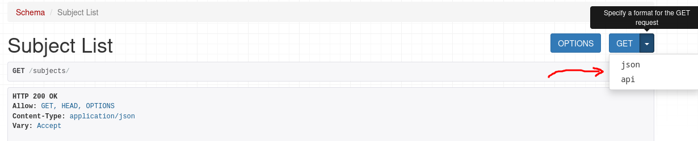
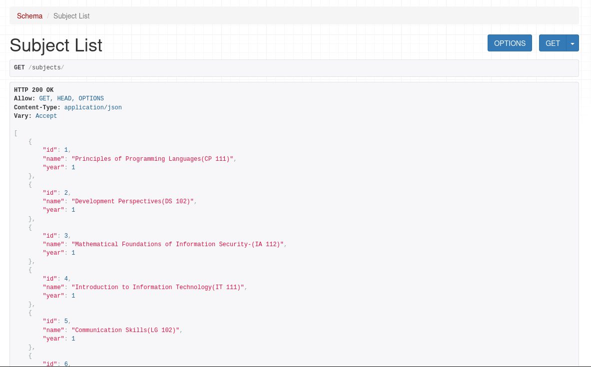
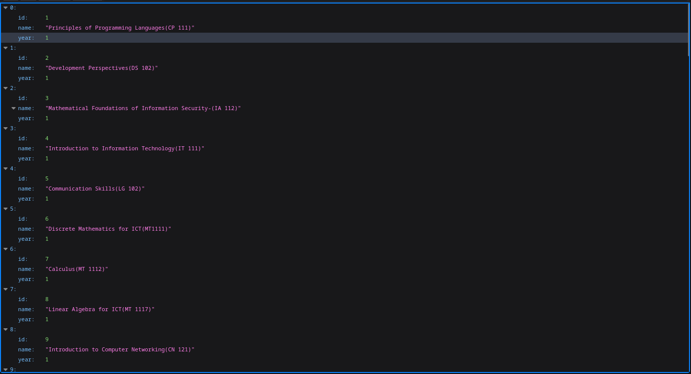
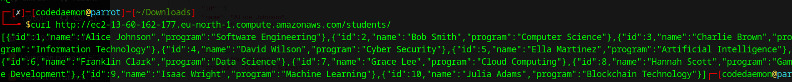

# REGISTRATION: E21-03-03796
# Simple Student and Subject API

This project is a simple API built using Python (Django), Gunicorn, and Nginx. It provides two endpoints to retrieve student and subject information.

## Project Description

This API was developed to fulfill the requirements of a task that involved creating a basic RESTful API to manage student and subject data. The API interacts with a relational database (e.g., PostgreSQL, MySQL, or SQLite) to store and retrieve data. The API is deployed using Gunicorn as an application server and Nginx as a reverse proxy.

## Technologies Used

* **Python:** Programming language.
* **Django:** Web framework.
* **Gunicorn:** WSGI HTTP server.
* **Nginx:** Web server/reverse proxy.
* **Relational Database Management System (RDBMS):** ( SQLite).
* **Git:** Version control.
* **JSON:** Data format for API responses.

## Setup Instructions

1. **Clone the Repository:**

    ```bash
    git clone <repository_url>
    cd <project_directory>
    ```

2. **Create a Virtual Environment (Recommended):**

    ```bash
    python3 -m venv venv
    source venv/bin/activate  # On Linux/macOS
    venv\Scripts\activate  # On Windows
    ```

3. **Install Dependencies:**

    ```bash
    pip install -r requirements.txt
    ```

4. **Configure Database:**

    * Run migrations to create database tables:

        ```bash
        python manage.py makemigrations
        python manage.py migrate
        ```

    * Populate the database with sample student and subject data. You can either use Django's shell or run the following commands

        ```bash
        chmod +x ./students.sh
        chmod +x ./subjects.sh
        ./students.sh
        ./subjects.sh
        ```

5. **Run the Django Development Server (for testing):**

    ```bash
    python manage.py runserver
    ```

    The API will be available at `http://127.0.0.1:8000/`.
6. **Basic API navigation**
    By default the API i accessible through the browserable view as seen below from the web browser.
    
    * for GUI interaction with the API choose API (default)
        
    * for pure json response choose JSON
        
        or user command-line tools or postman
        

7. **Read API documenation [here](http://ec2-13-60-162-177.eu-north-1.compute.amazonaws.com/) or visit `http://127.0.0.1:8000/` from your local development server**

## Dependencies

* Django
* Gunicorn
* psycopg2 (if using PostgreSQL) or mysqlclient (if using MySQL) or sqlite3 (if using SQLite)
* Any other required packages listed in `requirements.txt`.

# Assignment 2

## Types of Backups

There are mainly three strategies used to back up applications in software development.

### 1. Full Backup

In a full backup, all project files and data are copied and stored in a backup storage regularly. For example, if backups are scheduled to be done on Sunday, Monday, and Tuesday, each of these backups will generate a full copy/instance/snapshot of the application at the time the backup was made.

#### Advantages
1. It is a fast restoration strategy as it does not require backtracking or referencing previous backups to restore the system.
2. System restoration and recovery time is fast and straightforward.
3. All data is stored in one place, making it easier to manage.

#### Disadvantages
1. Requires high bandwidth to perform the backup operation.
2. High storage consumption since every backup stores the entire project and its data, even if no changes occurred.

---

### 2. Differential Backup

This strategy only copies data that has changed since the last full backup. For example, if the last full backup was made on Sunday, then the backups made on Monday, Tuesday, and so on will contain only the changes since Sunday.

#### Advantages
1. Saves storage space compared to full backups.
2. Faster to execute than a full backup, since only changed files are copied.
3. Easier to restore than incremental backups, requiring only the last full backup and the latest differential backup.

#### Disadvantages
1. Requires more storage than incremental backups, as data changes accumulate with each backup until the next full backup.
2. Recovery takes slightly longer than a full backup, as it involves at least two backup files (the full and the latest differential).

---

### 3. Incremental Backup

This strategy only copies data changes since the last backup of any kind—whether full or incremental. For example, if a full backup is made on Sunday, an incremental backup on Monday will store changes since Sunday, and Tuesday's backup will store only changes since Monday's backup, and so on.

#### Advantages
1. Saves the most storage space of all three strategies.
2. Backup operations are quick and require minimal resources.
3. Efficient in terms of time and bandwidth.

#### Disadvantages
1. Restoration can be slow and complex, as it requires the last full backup and every incremental backup made since then.
2. If one incremental backup is lost or corrupted, all subsequent backups may become unusable.
3. Higher potential for data inconsistency during restoration if backups are not properly managed.

## Bash Script Usage

1. Update permission to allow execution
    ```bash
    chmod +x ./backup_scripts/health_check.sh
    chmod +x ./backup_scripts/update.sh
    chmod +x ./backup_scripts/backup_api.sh
    ```
2. execute the files
    ```bash
    ./backup_scripts/health_check.sh
    ./backup_scripts/update.sh
    ./backup_scripts/backup_api.sh
    ```
# Assignment 3

## Building Docker Images

1. **Build the Docker images**  
   This will build two images: one for the database and one for the Django app.
   ```bash
   docker-compose build
   ```

   Or to build individually:
   ```bash
   docker build -t sqlite-db ./database
   docker build -t api-app .
   ```

---

## Deploying and Managing Containers using Docker Compose

- **Start all containers:**
  ```bash
  docker-compose up -d
  ```

- **Stop all containers:**
  ```bash
  docker-compose down
  ```

- **View running containers:**
  ```bash
  docker ps
  ```

- **Rebuild and restart containers after changes:**
  ```bash
  docker-compose up -d --build
  ```

- **View container logs:**
  ```bash
  docker-compose logs
  ```

- **Execute commands inside the app container:**
  ```bash
  docker exec -it api bash
  ```

---

## Troubleshooting Tips

| Problem | Solution |
|:--------|:---------|
| `manage.py not found` error | Ensure your `Dockerfile` correctly copies your Django project files with `COPY . .` and that you are in the right working directory (`WORKDIR /home/app`). |
| Database not persisting data | Make sure the `sqlite-data` volume is correctly mounted in both `app` and `database` services. Check `volumes` config in `docker-compose.yml`. |
| App container exits immediately | Check the logs using `docker logs api` to see if there are Python errors or database connection problems. |
| Port 8000 already in use | Stop any process using that port (`sudo lsof -i :8000`) and kill it, or change the port mapping in `docker-compose.yml`. |
| Permissions error on `.sh` scripts | Ensure `students.sh` and `subjects.sh` have executable permissions (`chmod +x students.sh subjects.sh`) before building the Docker image. |
| Container keeps restarting | Inspect the container logs carefully (`docker-compose logs`) for migration or startup issues in Django. |

---

## Notes
- The Django app runs on **http://localhost:8000** by default.
- Database files will persist under Docker volume `sqlite-data` even if containers are destroyed.


# Assignment 4
- Instructions to build/run front-end containers.
  ```bash
  cd ./frontend
  docker build -t frontend .
  docker run -id --name myfrontend -p 80:80 frontend
  ```
- Load balancer setup details (round-robin, health checks).
  inspect the nginx.conf file. by default nginx uses round robin for load distribution as for health check. this is a feature available only to nginx plus(commercial), **However** strategies frontend apps are configured to have a maximum error rate of 5 errors for every 30seconds. if the error limit is reached. nginx simple flags the server as available for the comming 30s and then tries again.
- AWS Setup
  1. simply install docker and docker compose
  2. pull the repo
  3. create a bridge network for the containers
    ```bash
      docker network create \
      --driver bridge \
      --subnet 172.20.0.0/24 \
      my-bridge
    ```
  4. enter in the project directory and run
    ```bash
      docker-compose up --build -d
    ```

## Images Links in Docker Hub

- [Database](https://hub.docker.com/repository/docker/jehoshaphat/database/general)
- [Backend](https://hub.docker.com/repository/docker/jehoshaphat/app/general)
- [Load Balancer](https://hub.docker.com/repository/docker/jehoshaphat/load_balancer/general)
- [frontend](https://hub.docker.com/repository/docker/jehoshaphat/frontend-app/general)
---
